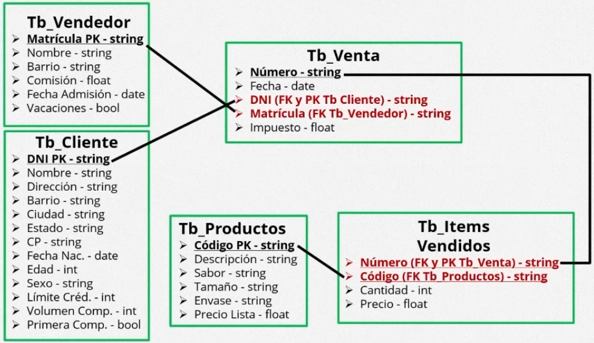

# Proyecto Final MySQL

Creación de base de datos para un negocio de jugos, en la cual tiene registrados a clientes, vendedores, productos, facturas, item vendidos.

Uso de *Triggers* y *Stored Procedures* para la manipulación avanzada de los datos.

Se simula las compras mediante el uso de *Stored Procedures* y registrando la transacción en las tablas respectivas.

El fichero **empresa_dump.sql** es el respaldo de la base de datos *empresa*, las tablas, triggers, stored procedures, funciones.

## Entidades

* *tb_vendedor*  :  tabla que contiene los datos de los vendedores.
* *tb_cliente*  :  tabla que contiene los datos de los clientes.
* *tb_productos*  : tabla que contiene los datos de los productos.
* *tb_items_vendidos*  :  tabla que contiene los datos de los items vendidos, teniendo dos claves foráneas apuntando hacia *tb_vendedor* y *tb_venta*.
* *tb_venta*  : tabla que contiene los datos de las ventas realizadas, tiene dos claves foráneas apuntando hacia *tb_cliente* y *tb_vendedor*.

## Simulación de compra

Se llama el *Stored Procedure* `sp_venta` para simular una compra, al ingresar los datos a las tablas `tb_venta` y `tb_items_vendidos` se actualizará la tabla `facturacion` que mantiene los datos de año y la cantidad total del año actual en ventas, para las operaciones *INSERT*, *UPDATE*, *DELETE* se utilizaron triggers que llaman al *stored procedure* `sp_triggers`.

## Stored Procedures

* `sp_venta`  :  simula una compra, tiene los siguientes parámetros:
    * Fecha.
    * Número máximo de items.
    * Numero máximo de cantidad.

* `sp_triggers`  :  actualiza la tabla `facturacion`.

## Triggers

Llaman a *sp_triggers* que actualizará la tabla *facturacion*, todos apuntando a la tabla `tb_venta`.

* `TG_INSERT_VENTA`
* `TG_UPDATE_VENTA`
* `TG_DELETE_VENTA`

## Funciones

* `f_aleatorio(min, max)`  : retorna un valor tipo *INT*.
* `f_cliente_dni_aleatorio()`  : retorna un número de *DNI* de la tabla de clientes.
* `f_producto_aleatorio()`  : retorna el código de un producto aleatorio.
* `f_vendedor_aleatorio()`  : retorna la matrícula de un vendedor aleatorio.

